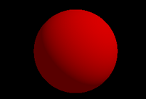
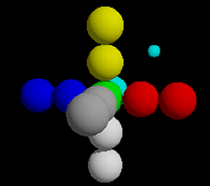
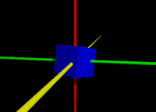

# POV-Ray_Lessons
Code of YouTube POV-Ray tutorials. It will be easier for you to experiment with.

This repo contains the codes shown in the YT POV-Ray tutorials I could find. There are two folders: 

[Felbrigg](#felbriggs-pov-ray-lessons) and [Joe Mercer](#joe-mercers-pov-ray-lessons)

There is also a **screenshots** folder that contains the images used
in this readme.

Both are good introductions, unfortunately they are not finished. Both
tutorials were supposed to be longer, but they stop after 7 or 8
lessons. They end both with "in the next lesson, we'll cover xxxx" but
there is **no** next lesson unfortunately. As far as I understand,
Felbrigg started to be paid to do a more complete course for a
learning company, and Joe Mercer simply stopped his courses.

In any case, I thank Felbrigg and Joe Mercer for what the lessons they
uploaded on youtube and I am grateful they did that. You have a nice
introduction to POV-Ray with them. They are many tutorials available
on internet, although not on video (and they are probably more YT
POV-Ray lessons somewhere).

### Here are some other POV-Ray resources:

* The official [POV-Ray tutorial](https://www.povray.org/documentation/3.7.0/t2_0.html)

* Friedrich A. Lohmüller [tutorial](https://www.f-lohmueller.de/index.htm), available in several languages. Friedrich is now deceased (RIP) but thanks to his wife his work did not disappear.

There are probably more useful resources.

Now, the lessons:
\ \

## Felbrigg's POV-Ray lessons

The playlist can be found [here](https://youtube.com/playlist?list=PLmsmiTEKs42uwPUFC06tFV9_4OlZLfOZi&si=bBx6W82t9Y6suvpp).

### Lesson 1: the ball
[Lesson 1](https://youtu.be/WZrY32jSjvU?si=BBC-pyFwAEIXhicq) introduces you to POV-Ray, what it can do.

You will create a nice ball:

The code can be found [here](Felbrigg/lesson1).

### Lesson 2: understanding the coordinates
[Lesson 2](https://youtu.be/cMyR0iJhfZQ?si=kbSwNwvG8zO5SxcN) shows you how POV-Ray places the objects.

The code can be found [here](Felbrigg/lesson2).

### Lesson 3: cylinder, box. Rotations.
[Lesson 3](https://youtu.be/KmuAVfU3tws?si=LVVq52GlPYtq5Cz5)

The code can be found [in Felbrigg/lesson3](Felbrigg/lesson3).

### Lesson 4: include file, box rotate and translate
[Lesson 4](https://youtu.be/JzeOWELZ2NY?si=Mnr5MlrJHIYlrYwE)

The code can be found here.

### Lesson 5: comments, background and plane
[Lesson 5](https://youtu.be/NmcX--iYxBI?si=_pd0X17m1hx7lswJ)

insert here a screenshot

The code can be found here.

### Lesson 6: torus, scale, triangle, declare, union, while
[Lesson 6](https://youtu.be/K00Q_Zc_KrU?si=5dUj-BlhDQ8ZC7KL)
This lesson is longer. You will create a jet engine the smart way, by repeating things.

insert here a screenshot

The code can be found here.

### Lesson 7: Constructive Solid Geometry
[Lesson 7](https://youtu.be/p7MivkXrzlc?si=jPswY7OjegrCxN-0)
You will learn about diff, union, merge, intersection. This lesson also shows color pigments.

insert here a screenshot

The code can be found here.

## Joe Mercer's POV-Ray lessons

add some text here