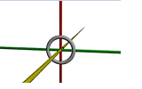

# POV-Ray_Lessons
Code of YouTube POV-Ray tutorials. It will be easier for you to experiment with.

For French audience: lisez cette page directement en Français! (traduction par gg translate) C'est [par ici](https://github-com.translate.goog/fabbricius/POV-Ray_Lessons?_x_tr_sl=bg&_x_tr_tl=fr&_x_tr_hl=fr&_x_tr_pto=wapp).

This repo contains the codes shown in several POV-Ray tutorials I could find on Youtube. There are three folders: 

[Felbrigg](#felbriggs-pov-ray-lessons)

[Joe Mercer](#joe-mercers-pov-ray-lessons)

The [more_tutorials](#more-tutorials) folder contains several single-video tutorials that are availables on youtube.

[More resources](#here-are-some-other-pov-ray-resources)
There are also some resources I gathered.

There is also a **screenshots** folder that contains the images used
in this readme.

Both are good introductions, unfortunately they are not finished. Both
tutorials were supposed to be longer, but they stop after 7 or 8
lessons. Too bad !

In any case, I thank Felbrigg and Joe Mercer for what the lessons they
uploaded on youtube and I am grateful they did that. You have a nice
introduction to POV-Ray with them. They are many tutorials available
on internet, although not on video (and they are probably more YT
POV-Ray lessons somewhere).

---

Now, the lessons:

---

## Felbrigg's POV-Ray lessons

The playlist can be found [here](https://youtube.com/playlist?list=PLmsmiTEKs42uwPUFC06tFV9_4OlZLfOZi&si=bBx6W82t9Y6suvpp).

### Lesson 1: the ball
[Lesson 1 on Youtube](https://youtu.be/WZrY32jSjvU?si=BBC-pyFwAEIXhicq) introduces you to POV-Ray, what it can do.

You will create a nice ball:

The code can be found [here](Felbrigg/lesson1).

### Lesson 2: understanding the coordinates
[Lesson 2 on Youtube](https://youtu.be/cMyR0iJhfZQ?si=kbSwNwvG8zO5SxcN) shows you how POV-Ray places the objects.

The code can be found in [Felbrigg/lesson2](Felbrigg/lesson2).

### Lesson 3: cylinder, box. Rotations.
[Lesson 3 on Youtube](https://youtu.be/KmuAVfU3tws?si=LVVq52GlPYtq5Cz5)

The code can be found in [Felbrigg/lesson3](Felbrigg/lesson3).

### Lesson 4: include file, box rotate and translate
[Lesson 4 on Youtube](https://youtu.be/JzeOWELZ2NY?si=Mnr5MlrJHIYlrYwE)

The code can be found in [Felbrigg/lesson4](Felbrigg/lesson4).

### Lesson 5: comments, background and plane
[Lesson 5 on Youtube](https://youtu.be/NmcX--iYxBI?si=_pd0X17m1hx7lswJ)

The code can be found in [Felbrigg/lesson5](Felbrigg/lesson5).

### Lesson 6: torus, scale, triangle, declare, union, while
[Lesson 6 on Youtube](https://youtu.be/K00Q_Zc_KrU?si=5dUj-BlhDQ8ZC7KL)
This lesson is longer. You will create a jet engine the smart way, by repeating things.

You will go from this basic torus:

to this super cool jet engine:

Nice, isn't it ?

The code can be found in [Felbrigg/lesson6](Felbrigg/lesson6).

### Lesson 7: Constructive Solid Geometry
[Lesson 7 on Youtube](https://youtu.be/p7MivkXrzlc?si=jPswY7OjegrCxN-0)
You will learn about diff, union, merge, intersection. This lesson also shows color pigments, transparency.

The code can be found in [Felbrigg/lesson7](Felbrigg/lesson7).

### Bonus: POV-Ray tip for a failing difference
[Bonus ("Lesson 8") on Youtube](https://youtu.be/q2I1ojhf2SM?si=BOLskU032BTEsRqD)

A small tip when objects obtained by the mean of a "diff" are failing.

The code can be found in [Felbrigg/bonus](Felbrigg/bonus).

---

## Joe Mercer's POV-Ray lessons

Joe Mercer POV-Ray lessons playlist can be found here: [Joe Mercer POV-Ray lessons](https://www.youtube.com/watch?v=YiXV4EPnTyg&list=PLlW5kivBxMYtCFiSnhlhceFsTSCeuJImm)

### Lesson 0: installing POV-Ray on Windows
[Lesson 0 on Youtube](https://youtu.be/YiXV4EPnTyg?si=7JCwjYlBefsdD_4e) how to install POV-Ray on Windows (the installer can be found on [www.povray.org](https://www.povray.org/))

There is no code on this lesson.

### Lesson 1: balls (it's start, right ?)
[Lesson 1 on Youtube](https://youtu.be/1ZDWcEQrqsc?si=FIgKVPUI63EIWVwX) Getting started. You will create balls and learn about colors.

Here is what you will create:

Nice start, isn't it?

The code can be found [here](JoeMercer/lesson1).

### Lesson 2: transformations
[Lesson 2 on Youtube](https://youtu.be/h4y0aami5XI?si=UKPCwsAuoedaozfN) 

You will learn about transformation: scale, rotate, translate, and also about "sky sphere" gradient.
It is used to create a realistic sky. 

The code can be found [here](JoeMercer/lesson2).

### Lesson 3: cylinder, box, cone, torus
[Lesson 3 on Youtube](https://youtu.be/qOcMhwmoWC8?si=HUv0ukbkz4BXbsQX)

You will learn about basic objects used to create things.

The code can be found [here](JoeMercer/lesson3). Some parts are commented, using the standard C-style comment sign. You can remove the comments as you experiment with the code by watching the video at the same time.

### Lesson 4: rotations, color maps, image maps
[Lesson 4 on Youtube](https://youtu.be/rMg5qtROb8M?si=zaYWkO9dFDobrEmf)

You will learn a lot in this lesson: rotation, color maps, and how to map a color gradient or an image on a surface, which is very useful!

Box rotated:

Gradients mapped on a box:

Gradient with 3 colors:

The code can be found [here](JoeMercer/lesson4). Some parts are commented, using the standard C-style comment sign. You can remove the comments as you experiment with the code by watching the video at the same time. The folder also contains the image which will mapped on the box. You can use it directly.
There are also the code for the grids that are used at the begining of the lesson.

Final screenshot:

### Lesson 5: placing image maps on curved objects
[Lesson 5 on Youtube](https://youtu.be/KlVpVEBvp-g?si=X0nzZRVa-7wM7XTh)

In this lesson you will learn about image mapping. There are severla type of mapping, and each of them are adapted to what you want to map them on.

Image mapped on a box:

The same image mapped on a cylinder:

The code can be found [here](JoeMercer/lesson5). The images used in the messon are there, too. I did a screenshot on youtube as fullscreen and modified the resolution to match what Joe was using. Everything is ready to compile.
There are also the code for the images presented by Joe to explain the different types of mapping and how they must be used on curved objects. Among them is the landscape that Joe maps on the cylinder, and also the world map.

Understanding the type of maps:

Mapping a landscape on a cylinder:

Mapping an image on a box, a cylinder and a thiner cylinder:

World Map, mapped on a sphere:

### Lesson 6: S.O.R. (Surface of revolution)

In this lesson, you will learn a new way of creating curved objects: by entering coordinates of points that will be linked one to the other in order to create a nice curve. 

[Lesson 6 on Youtube](https://youtu.be/QKqO5V8FYPU?si=xrziI8zA5kuL9Ek-)

Look at the nice pot you will create:

This pot is constructed by the means of SOR (Surface of Revolution): points are entered, then the line obtained is rotated around an axis. The pot above is created this way:

Then the pot will be "digged":

Then an image will be mapped on the pot to obtain the final pot:

The code for this essential lesson can be found [here](JoeMercer/lesson6)

### Lesson 7: sphere sweeps, spline, unions
[Lesson 7 on Youtube](

In this lesson you will learn about sweeps. 

First sphere moves to another position with a linear spline:

The same with four points, but still on a linear spline. You get a baseball bat:

And now you use a cubic spline:

The 'b' spline [Bézier curve](https://en.wikipedia.org/wiki/B%C3%A9zier_curve) is similar. Joe compares the 3 types of splines in sub-lesson c (in my repo it's file JoeMercerLesson7c.pov):

From top to bottom:
- Bézier spline (nice smooth transition)
- cubic spline
- linear spline

With five points (sub-lessons d and e):

By improving the spline (Bézier), you get this:

Comparing splines:

From left to right:
- linear spline
- cubic spline
- linear spline

The rest of the lesson uses what was learned before to build a coffee cup that is drawn here in 2D:

After coding this into POV-Ray (look for files JoeMercerLesson7Cup files):

Then Joe will it more thickness:

Then an image will be mapped to it. The final coffee cup is shown here:

The code can be found [here](JoeMercer/lesson7). 

This is the last lesson. In the (non-existing) next lesson, Joe was going to talk about triangles and polygon. Too bad he stopped his super tutorial. Thanks to him anyway for the first lessons, they are great.

## More tutorials 1: Josie's cup

How to create a cup in POV-Ray (lesson in spanish): [Cómo crear una COPA en POV-RAY](https://youtu.be/IJnfv8B5lFw?si=JswceNnbBRgLVLyj)
In this short lesson you will create a glass of wine. It's in spanish but you can translate it into any language (I've watched it with french subtitles).
The code can be found in the  file, in the [more_tutorials folder](more_tutorials).
Here is what you will obtain: 

## More tutorials 2: Geometric Shapes
Render Geometric Shapes on a Realistic Environment: [Render Geometric Shapes](https://youtu.be/TaX6rF4BvjY)
You will create many stuff in this lesson. There are very few explaination, but what's nice in POV-Ray is that you can just look at the code to see how it's made!
The code can be found in the  file, in the [more_tutorials folder](more_tutorials). There is also a small gif file, makta_map.gif, which is used as an image *mapped* onto a sphere (sunglasses with a nose and a smile). This file differs a bit from the one used in the video, but I had to do this as the original file is not given.
Here is what you will get: 

## Here are some other POV-Ray resources:

* The official [POV-Ray tutorial](https://www.povray.org/documentation/)
This is the official documentation from the POV-Ray site. A bit hard if you start, in my opinion.

* Friedrich A. Lohmüller [tutorial](https://www.f-lohmueller.de/index.htm), available in several languages. Friedrich is now deceased (RIP) but thanks to his wife his work did not disappear. Great documentation!

* a PDF file "A short introduction to POV-Ray" from a german university. file availaible [here](https://sus.ziti.uni-heidelberg.de/Lehre/SS_Tools/POVRAY/POVRAY_PeterFischer.pdf)

* a PDF file from an american university: [AM 205 POV-Ray tutorial](https://people.math.wisc.edu/~chr/am205/g_act/am205_povray.pdf).

* 25 POV-Ray scenes, with the code and screenshots. It's [here on github](https://github.com/susam/pov25).
One example: 

* Build a [Tron lightcycle in POV-Ray](https://youtu.be/AxiEZKNh_1E?si=KYf5Cmt4f5NAG5ni). This youtube lesson made by Pixelpaws 3D is very nice. The code is not included on this github repository, you can find it on the video description for a small fee. Direct link to scene [here](https://pixelpaws3d.gumroad.com/l/atbbf). Find more on his [Artstation space](https://www.artstation.com/dcmarriott).
The Tron motorcycle in question: 

There are probably more useful resources.

